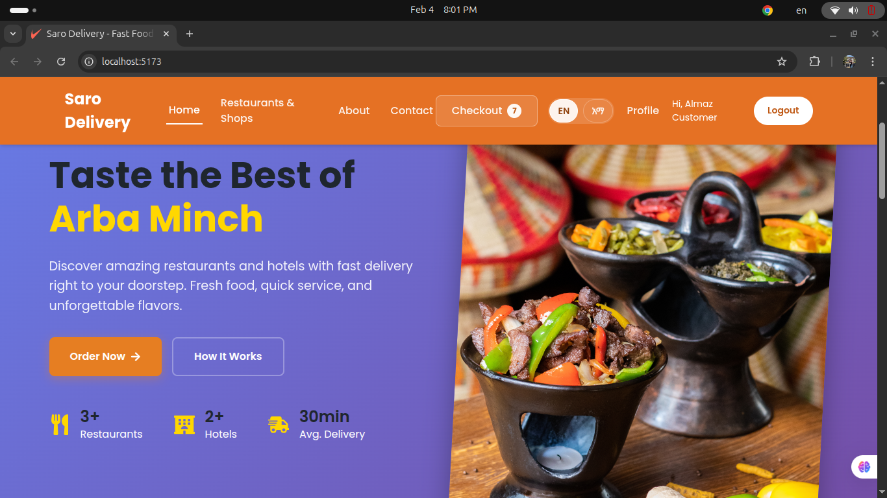

# 🚚 Saro Delivery

A modern, full-stack delivery application for Ethiopian restaurants and vendors with real-time order tracking, integrated payment processing via Chapa, and role-based dashboards for customers, vendors, drivers, and administrators.


## 📸 Website Screenshot



## ✨ Features

### 🛒 Customer Features
- Browse restaurants and vendors
- View menus and add items to cart
- Place orders with delivery address
- Real-time order tracking on interactive map
- Secure payment via Chapa payment gateway
- Order history and status updates
- User authentication and profile management

### 🏪 Vendor Features
- Vendor dashboard with order management
- Product/menu management (add, edit, delete items)
- Real-time order notifications
- Order status tracking and updates
- Sales analytics and reporting

### 🚗 Driver Features
- Driver dashboard with available deliveries
- Accept/reject delivery requests
- Real-time navigation and route optimization
- Update delivery status (picked up, in transit, delivered)
- Delivery history and earnings tracking

### 👨‍💼 Admin Features
- System-wide dashboard and analytics
- User management (customers, vendors, drivers)
- Order monitoring and oversight
- Platform configuration and settings

### 🔧 Technical Features
- **Real-time Communication**: WebSocket integration via Socket.IO
- **Secure Authentication**: JWT-based authentication with bcrypt password hashing
- **Payment Integration**: Chapa payment gateway for Ethiopian market
- **Interactive Maps**: Leaflet maps for order tracking and navigation
- **RESTful API**: Well-documented API with Swagger documentation
- **Security**: Helmet.js, CORS, rate limiting, and input validation
- **Logging**: Winston logger with file and console transports
- **Modern UI**: Responsive design with custom design system

## 🏗️ Tech Stack

### Frontend
- **Framework**: React 18 with Vite
- **Routing**: React Router DOM v6
- **State Management**: React Context API
- **HTTP Client**: Axios
- **Real-time**: Socket.IO Client
- **Maps**: Leaflet & React Leaflet
- **Styling**: Custom CSS with design system variables

### Backend
- **Runtime**: Node.js with Express.js
- **Database**: MongoDB with Mongoose ODM
- **Authentication**: JWT (jsonwebtoken) with bcrypt
- **Real-time**: Socket.IO
- **Payment**: Chapa API integration
- **Security**: Helmet, CORS, express-rate-limit
- **Validation**: Joi
- **Logging**: Winston & Morgan
- **API Docs**: Swagger (swagger-jsdoc, swagger-ui-express)

## 📋 Prerequisites

Before you begin, ensure you have the following installed:
- **Node.js** (v16 or higher)
- **npm** (v8 or higher)
- **MongoDB** (v5 or higher) - running locally or remote instance
- **Git** (for cloning the repository)

## 🚀 Getting Started

### 1. Clone the Repository

```bash
git clone <repository-url>
cd "Saro Delivery"
```

### 2. Backend Setup

Navigate to the backend directory and install dependencies:

```bash
cd backend
npm install
```

Create a `.env` file in the backend directory:

```bash
cp .env.example .env
```

Edit the `.env` file with your configuration:

```env
# Environment
NODE_ENV=development
PORT=5000

# Database
MONGODB_URI=mongodb://localhost:27017/saro-delivery

# JWT Configuration
JWT_SECRET=your-super-secret-jwt-key-change-in-production
JWT_EXPIRE=30d

# Chapa Payment Gateway
# Get your test key from https://dashboard.chapa.co
CHAPA_SECRET_KEY=CHASECK_TEST-your-chapa-test-key

# CORS Configuration
ALLOWED_ORIGINS=http://localhost:5173,http://localhost:3000

# Frontend URL
FRONTEND_URL=http://localhost:5173

# Rate Limiting
RATE_LIMIT_WINDOW_MS=900000
RATE_LIMIT_MAX_REQUESTS=100

# Logging
LOG_LEVEL=info
```

#### Seed Sample Data (Optional)

To populate the database with sample data:

```bash
node seeder.js
```

This creates:
- Sample vendors and products
- Test users (customer, vendor, driver, admin)
- Sample orders

Start the backend server:

```bash
npm run dev
```

The backend will run on `http://localhost:5000`

### 3. Frontend Setup

Navigate to the frontend directory and install dependencies:

```bash
cd ../frontend
npm install
```

Start the frontend development server:

```bash
npm run dev
```

The frontend will run on `http://localhost:5173`

## 🔑 Test Users

After running the seeder, you can log in with these test accounts:

| Role | Email | Password |
|------|-------|----------|
| Admin | admin@saro.com | admin123 |
| Customer | customer@test.com | customer123 |
| Vendor | vendor@test.com | vendor123 |
| Driver | driver@test.com | driver123 |

## 📁 Project Structure

```
Saro Delivery/
├── backend/
│   ├── config/          # Configuration files (db, logger, swagger)
│   ├── controllers/     # Route controllers
│   ├── middleware/      # Express middleware (auth, error, validation)
│   ├── models/          # Mongoose models
│   ├── routes/          # API routes
│   ├── utils/           # Utility functions
│   ├── logs/            # Application logs
│   ├── server.js        # Entry point
│   ├── seeder.js        # Database seeder
│   └── package.json
│
├── frontend/
│   ├── src/
│   │   ├── components/  # Reusable React components
│   │   ├── pages/       # Page components
│   │   ├── context/     # React Context providers
│   │   ├── styles/      # CSS files and design system
│   │   ├── utils/       # Utility functions
│   │   ├── App.jsx      # Main app component
│   │   └── main.jsx     # Entry point
│   ├── index.html
│   └── package.json
│
└── documentation/       # Project documentation
```

## 🔌 API Documentation

Once the backend is running, access the Swagger API documentation at:

```
http://localhost:5000/api-docs
```

The API provides endpoints for:
- **Authentication** (`/api/auth`) - Register, login, profile
- **Orders** (`/api/orders`) - Create, read, update orders
- **Products** (`/api/products`) - Menu items and products
- **Vendors** (`/api/vendors`) - Vendor information and management
- **Users** (`/api/users`) - User management (admin only)

## 💳 Payment Integration

The application uses **Chapa** - Ethiopia's leading payment gateway, supporting:
- Mobile money (Telebirr, CBE Birr, etc.)
- Bank transfers
- Card payments

### Setting Up Chapa

1. Sign up at [https://dashboard.chapa.co](https://dashboard.chapa.co)
2. Get your test secret key from the dashboard
3. Add the key to your `.env` file as `CHAPA_SECRET_KEY`
4. For production, replace with your live secret key

## 🗺️ Real-time Features

The application uses Socket.IO for real-time updates:

- **Order Status Updates**: Customers see live order status changes
- **Delivery Tracking**: Real-time driver location updates
- **Notifications**: Instant notifications for new orders and status changes
- **Driver Assignment**: Live updates when drivers accept deliveries

## 🛠️ Available Scripts

### Backend

```bash
npm start          # Start production server
npm run dev        # Start development server with nodemon
node seeder.js     # Seed database with sample data
```

### Frontend

```bash
npm run dev        # Start development server
npm run build      # Build for production
npm run preview    # Preview production build
npm run lint       # Run ESLint
```

## 🔒 Security Features

- **JWT Authentication**: Secure token-based authentication
- **Password Hashing**: Bcrypt with salt rounds
- **Helmet.js**: Security headers
- **CORS**: Configured cross-origin resource sharing
- **Rate Limiting**: Prevent brute force attacks
- **Input Validation**: Joi schema validation
- **Error Handling**: Centralized error handling middleware

## 🌐 Environment Variables

### Backend Environment Variables

| Variable | Description | Default |
|----------|-------------|---------|
| `NODE_ENV` | Environment (development/production) | development |
| `PORT` | Server port | 5000 |
| `MONGODB_URI` | MongoDB connection string | mongodb://localhost:27017/saro-delivery |
| `JWT_SECRET` | JWT signing secret | (required) |
| `JWT_EXPIRE` | JWT expiration time | 30d |
| `CHAPA_SECRET_KEY` | Chapa payment gateway key | (required) |
| `ALLOWED_ORIGINS` | CORS allowed origins | http://localhost:5173 |
| `FRONTEND_URL` | Frontend URL for redirects | http://localhost:5173 |

## 🐛 Troubleshooting

### MongoDB Connection Issues
- Ensure MongoDB is running: `sudo systemctl status mongod`
- Check connection string in `.env`
- Verify network connectivity

### CORS Errors
- Check `ALLOWED_ORIGINS` in backend `.env`
- Ensure frontend URL matches the allowed origin

### Payment Failures
- Verify Chapa secret key is correct
- Check if test mode is enabled
- Review backend logs for error details

### WebSocket Connection Issues
- Ensure both frontend and backend are running
- Check browser console for Socket.IO errors
- Verify CORS configuration includes WebSocket support

## 📝 TO-DO / Future Enhancements

- [ ] Push notifications for mobile devices
- [ ] SMS notifications via Ethiopian telecom providers
- [ ] Advanced analytics and reporting
- [ ] Multi-language support (Amharic, Oromiffa)
- [ ] Review and rating system
- [ ] Loyalty programs and discounts
- [ ] Scheduled deliveries
- [ ] Mobile applications (iOS/Android)

## 🤝 Contributing

Contributions are welcome! Please follow these steps:

1. Fork the repository
2. Create a feature branch (`git checkout -b feature/AmazingFeature`)
3. Commit your changes (`git commit -m 'Add some AmazingFeature'`)
4. Push to the branch (`git push origin feature/AmazingFeature`)
5. Open a Pull Request

## 📄 License

This project is licensed under the MIT License - see the LICENSE file for details.

## 👥 Authors

- **Feleke Eshetu** - Initial development

## 🙏 Acknowledgments

- Chapa for payment gateway integration
- Leaflet for mapping functionality
- The Ethiopian tech community for support and feedback

## 📞 Support

For support, email support@sarodelivery.com or open an issue in the repository.

---

**Built with ❤️ for the Ethiopian market**
